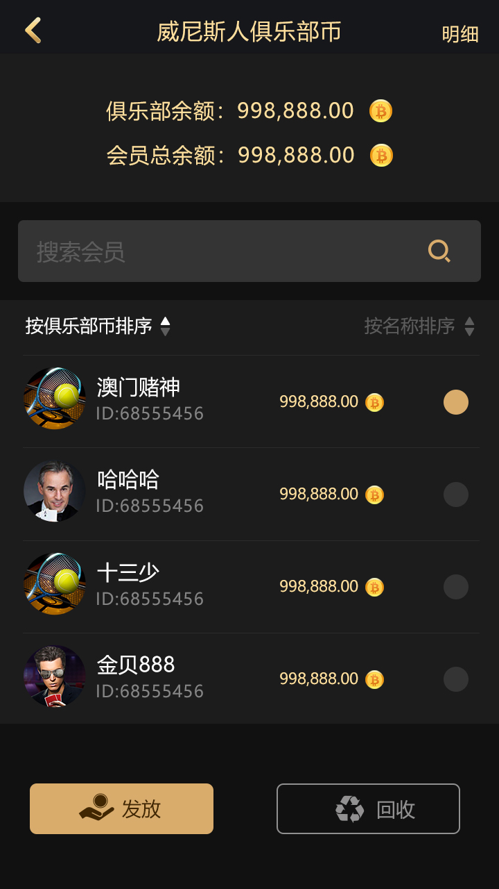
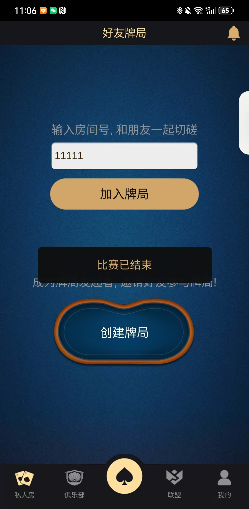

[简体中文](README.md) | [繁體中文](README.zh-TW.md) | [English](README.en.md)

# Web、H5 德州撲克俱樂部與賽事平台|德州扑克源码

💡 快速搭建屬於你的德州撲克平台

💡 快速建立自己的德州撲克系統

🔥 Online Multiplayer System

🔥 Club + Agent System

🔥 Real-Time Gameplay

---

## 🚀 Quick Overview | 快速介紹 | 快速介紹

快速建立自己的德州撲克平台，支援多人對戰、俱樂部與代理商系統。

適用於開發與客製化部署。

---

## ✨ Key Features | 核心功能 | 核心功能

- 🧑‍🤝‍🧑 Multiplayer Poker（多人對戰）

- 🏆 Club System（俱樂部系統）

- 🧩 Agent System（代理體系）

- ⚡ Real-time Gameplay（即時對局）

- 🌐 Online Server（線上伺服器）

- 🔧 Customizable（可二次開發）

---

## ⚡ Quick Start |  快速開始

> **線上穩定營運多年 | 支援聯盟/俱樂部/私人局 | 媲美hhpoker, wpk | 原始碼+美術+維運腳本**

## 🎮 Demo | 演示 

See real gameplay below 👇
  
**MTT賽事介面 | MTT Tournament**
  
**個人中心介面 | Personal Center**
  
**俱樂部幣界面 | Club Currency**
  
**建立俱樂部介面 | Create Club**
  
**加入聯盟介面 | Join Alliance**
  
**好友局介面 | Friends Room**
  
**打牌房間介面 | Gameplay Room**

🚀 Perfect for building poker apps, platforms, or learning real-time game development

### 🔥 為什麼要選擇這套原始碼？

這是一套 **真正上線運營多年、久經考驗** 的德州撲克全套解決方案。
不同於市面上拼湊的Demo，我們的程式碼持續迭代，服務穩定，已被多個俱樂部用於實際運作。

### ✨ 核心賣點

- **完整玩法矩陣**：德州、奧馬哈、短牌、大鳳梨、MTT、SNG、AOF，**聯盟模式**全支援。

- **俱樂部/私人局**：完整的約局、俱樂部管理、保險、戰績統計功能。

- **高穩定性**：C++ 高效能服務端，支援千人同時在線，無壓力。

- **優質資源**：提供全套高清美術資源、UI原始檔、音效。

- **同類對比**：在功能、穩定性和擴展性上，**全面優於 hhpoker 和 wpk**。

### 🎯 功能清單

| 模組 | 功能說明 |

| :--- | :--- |

| **大廳系統** | 多玩法入口、公告、排行榜、商城 |

| **約局/俱樂部** | 好友約局、俱樂部創建/管理、聯盟賽事 |

| **牌桌邏輯** | 標準/短牌/奧馬哈，自動Buy-in，Straddle，保險 |

| **賽事系統** | MTT（多桌錦標賽）、SNG（坐滿即玩） |

| **後台管理** | 玩家管理、報表統計、局分調整、風險控制 |

### 🚀 技術架構

- **服務端**：C++ (高效率穩定)

- **客戶端**：Cocos Creator / Unity (可演示)

- **通訊**：Tars / 私有協議

- **資料**：MySQL + Redis

### 📦 交付內容

- 全份服務端源碼 + 客戶端源碼

- 完整的資料庫腳本

- 高清美術資源與UI源文件

- 部署維運腳本和文檔

### 💰 合作

- **聯絡方式**：📱 **Telegram：@xuzongbin001**

- **備用信箱**：📧 **masterai918@gmail.com**

---

### ⭐ 如何讓我們看見你？

1. **Star** 這個倉庫，方便你隨時找到。

2. **Fork** 到你的帳號，作為技術評估的起點。

3. **聯絡 TG @xuzongbin001**
